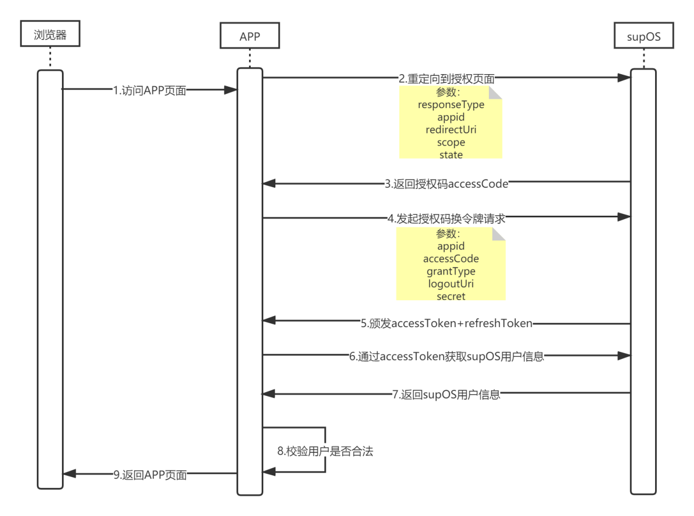
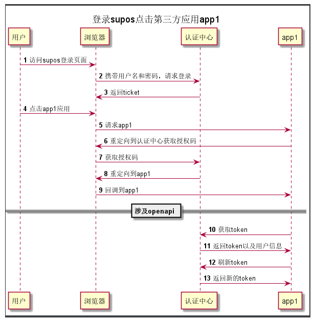

<p align="center">
    

</p>

-----------------------------------------------------------------------------------------------
# hostApp 对接supOS OAuth开发手册

----------

## 背景

合作伙伴系统通过iFreame页面嵌入的方式，集成到supOS工业互联网操作系统中。用户登录supOS系统后，点击菜单就可以直接进入合作伙伴的原型系统。
在这个过程之前需要合作伙伴在原型系统中至少默认存在admin用户（admin用户是supos的管理员账户），并且实现supOS提供的OAuth2.0授权认证接口，
双方系统校验用户的合法性后，方可进入原型系统的业务界面，并使用。本文主要描述的是合作伙伴如何实现OAuth2.0授权认证接口的说明。该示例集成
了supos2.7版本和3.0版本的auth2接口兼容。


### 原系统在线demo
* 账号密码：admin/111111，地址：http://demo.stylefeng.cn


### 时序图

<div align=center>
Supos2.7 版本授权认证流程
</div>


<div align=center>
Supos3.0 版本授权认证流程
</div>

### 集成过程

在集成之前，开发者可以获取到supOS系统的集成文档进行了解，地址如下：

http://app-integration-guide.partners.supos.net/


通常BS架构的系统后端都有一个接收请求的总入口，可能是过滤器、拦截器或者是Spring的AOP，主要代码如下

```java

    public void postHandle(HttpServletRequest request, HttpServletResponse response, Object handler, ModelAndView modelAndView) throws Exception {
        logger.info(">>>>>>>>>>>>>>>>>>>>>> requestUrl: " + request.getRequestURI());

        //没有视图的直接跳过过滤器
        if (modelAndView == null || modelAndView.getViewName() == null) {
            return;
        }

        //视图结尾不是html的直接跳过
        if (!modelAndView.getViewName().endsWith("html")) {
            return;
        }
        ShiroUser user = ShiroKit.getUser();

        if (user == null) {

            //以下为 Oauth2授权码认证过程
            String sessionId = getSessionIdFromCookie(request);
            //第一次 判断sessionId是否为空，如果为空 生成sessionID并且获得授权码  302地址
            if (StringUtils.isEmpty(sessionId)){
                //1. oAuth2的授权码模式：认证第一步：获得授权码   设置302地址
                redirect(request, response);
            } else {

                //根据supos版本选择auth接口


                //当session不为空， 302重新跳转进来  判断缓存中的token是否存在
                JSONObject cacheToken = cache.get(sessionId);
                //如果不存在
                if (cacheToken == null || StringUtils.isEmpty(cacheToken.getString("username"))) {
                    //获取授权code
                    String queryString = request.getQueryString();
                    logger.info(">>>>>>>>>>>>>>>>>>>>>> queryString: " + queryString);
                    String accessCode = queryString.substring(queryString.indexOf("=") + 1,queryString.indexOf("&"));
                    logger.info(">>>>>>>>>>>>>>>>>>>>>> accessCode: " + accessCode);
                    String logoutUri = request.getScheme() + "://" + request.getServerName() + ":" + request.getServerPort() + "/loginController/";
                    JSONObject token = new JSONObject();
                    //2. 授权码模式获取accessToken
                    AuthAccessToken authAccessToken = supAuth2Api.accessToken("", accessCode, logoutUri, "", "");
                    token.put("username",authAccessToken.getUsername());
                    token.put("tokenResult",authAccessToken);
                    cache.put(sessionId, token);

                } else {
                    AuthAccessToken refreshToken = supAuth2Api.refresh("", cacheToken.getJSONObject("tokenResult").getString("refreshToken"), cacheToken.getJSONObject("tokenResult").getString("accessToken"));
                    logger.info(">>>>>>>>>>>>>>>>>>>>>> refreshToken: " + refreshToken);
                    //当refreshToken接口返回成功，重新设置缓存
                    if (refreshToken != null && StringUtils.isNotEmpty(refreshToken.getAccessToken())){
                        cache.get(sessionId).put("username",refreshToken.getUsername());
                        cache.get(sessionId).put("tokenResult",refreshToken);
                    } else {
                        //当refreshToken失效时，需要重新进行授权码认证
                        //并且删除sessionId的缓存
                        cache.remove(sessionId);
                        //重走授权码认证
                        redirect(request, response);
                    }
                }
                User suposUser = userService.getByAccount(cache.get(sessionId).getString("username"));
                if(suposUser != null){
                    ShiroKit.getSession().setAttribute("username", suposUser.getAccount());
                    new LoginController().loginVali();
                } else {
                    throw new AuthenticationException("当前没有登录supos的账号登录该系统！");
                }
            }
            return;
        } else {
            modelAndView.addObject("name", user.getName());
            modelAndView.addObject("avatar", DefaultImages.defaultAvatarUrl());
            modelAndView.addObject("email", user.getEmail());
        }
    }
    
    public void redirect(HttpServletRequest request, HttpServletResponse response){
        String redirectUrl = request.getScheme() + "://" + request.getServerName() + ":"+request.getServerPort() + request.getRequestURI();
        // 在supOS的APP容器中运行，到后端的请求path，不会带上APP_PATH_PREFIX（/apps/{venderName}-{name}）
        String prefixPath = System.getenv("APP_PATH_PREFIX");
        String suposAddress = System.getenv("SUPOS_SUPOS_ADDRESS");
        if (StringUtils.isNotEmpty(prefixPath) && StringUtils.isNotEmpty(suposAddress)) {
            redirectUrl = suposAddress.concat(prefixPath).concat(request.getRequestURI());
        }
        Cookie cookie = new Cookie(COOKIE_SESSION_ID, UUID.randomUUID().toString().replaceAll("-", "").toLowerCase());
        logger.info(">>>>>>>>>>>>>>>>>>>>>> COOKIE_SESSION_ID : " + COOKIE_SESSION_ID);
        cookie.setPath("/");
        cookie.setHttpOnly(true);
        //1. oAuth2的授权码模式：认证第一步：获得授权码   设置302地址
        response.addCookie(cookie);
        response.addHeader(HttpHeaders.LOCATION, supAuth2Api.authorize("","",redirectUrl,"1"));
        response.setStatus(HttpStatus.FOUND.value());
    }
    
```

## 注意事项
### 2.7版本集成注意事项
    2.7版本集成auth2接口通过代码实现，实现类SupAuth2ApiImpl，本地调式时可修改代码，安装到supos后取环境变量
```java
    private static final String OAUTH2_URL = System.getenv("SUPOS_SUPOS_ADDRESS") == null ? "http://isv-integrate-1.demo.devcloud.supos.net/oauth2" : System.getenv("SUPOS_SUPOS_ADDRESS").concat("/oauth2");
    private static final String APP_ID = System.getenv("SUPOS_SUPOS_APP_ACCOUNT_ID") == null ? "App_b6ac673bba464552bb6761b9316a854b" : System.getenv("SUPOS_SUPOS_APP_ACCOUNT_ID");
    private static final String SECRET = System.getenv("SUPOS_SUPOS_APP_SECRET_KEY") == null ? "f3b6c5a824baa306be2ffc2b2bae50bc" : System.getenv("SUPOS_SUPOS_APP_SECRET_KEY");
```
    以及修改supos版本号，WebConfig类中修改默认版本号，比如当前默认2.7版本，安装到supos后取环境变量
```java
 @Override
    public void addInterceptors(InterceptorRegistry registry) {
        logger.info(">>>>>>>>>>>>>>>>>>>>>>>>>>>>>>>>>>>>>>>>>>>>>> SUPOS_VER: " + System.getenv("SUPOS_VER"));
        String supos_ver = (System.getenv("SUPOS_VER")) == null? "2.7":System.getenv("SUPOS_VER");
        registry.addInterceptor(new RestApiInteceptor()).addPathPatterns("/gunsApi/**");
        registry.addInterceptor(new AttributeSetInteceptor(apiVersionSelector.getSupAuth2Api(supos_ver),userService)).excludePathPatterns(NONE_PERMISSION_RES).addPathPatterns("/**");
    }
```
 
### 3.0版本集成注意事项
    3.0版本集成auth2接口通过引用工具包实现，工具包在lib目录下eco-java-sdk-3.0.0.1.1.jar引入，具体工具包使用说明参考
    http://app-integration-guide.partners.supos.net/integrate/plan/hosted/basic/3.0/SDK%E8%AF%B4%E6%98%8E%E6%96%87%E6%A1%A3.html

### 集成效果
   集成效果可参考集成文档中集成案例展示效果
   http://app-integration-guide.partners.supos.net/integrate/case/3.0/gun.html
  
